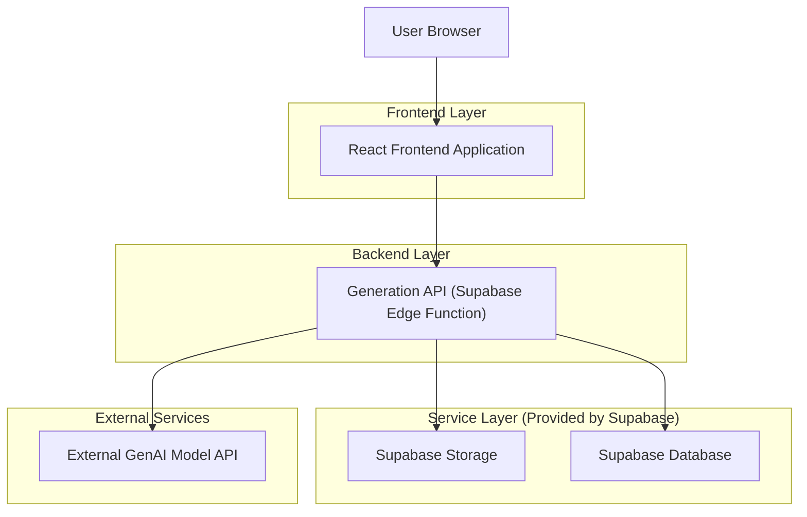
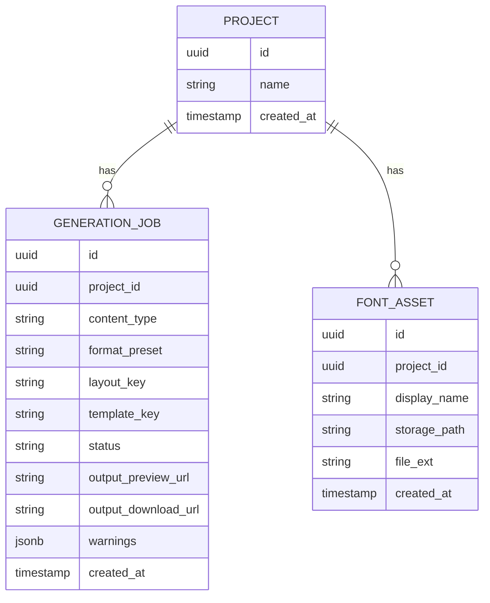

## 1.Architecture design


## 2.Technology Description
- Frontend: React@18 + TypeScript
- Backend: Supabase Edge Functions (API para geração; mantém segredos de modelo fora do browser)
- Database: Supabase (PostgreSQL)
- Storage: Supabase Storage (assets como fontes, thumbs e saídas geradas)

## 3.Route definitions
| Route | Purpose |
|-------|---------|
| / | Página inicial, acesso para a Fábrica |
| /fabrica | Fluxo Fábrica com **animação inicial** → **escolha do tipo (Imagem/Apresentação/Animação)** → **configuração específica por tipo** (tela única, sem wizard) |

## 4.API definitions (If it includes backend services)

### 4.1 Core API

Gerar conteúdo (imagem/apresentação/animação) a partir de preset + layout/template (quando aplicável)
```
POST /api/generate
```

Request (TypeScript)
```ts
type ContentType = "image" | "presentation" | "animation";

// Presets são específicos por tipo; manter como string enumerada no frontend conforme catálogo suportado.
type FormatPreset = string;

type LayoutKey =
  | "texto-esq/imagem-dir"
  | "imagem-esq/texto-dir"
  | "imagem-topo/texto-base"
  | "titulo/bullets"
  | "2-colunas-texto";

type GenerateRequest = {
  contentType: ContentType;
  format: FormatPreset;

  // Usado quando o tipo suportar estrutura/layout.
  layout?: LayoutKey;
  templateKey?: string;

  prompt: {
    objetivo?: string;
    tema?: string;
    publico?: string;
    tom?: string;
    cta?: string;
    restricoes?: string;
    raw?: string;
  };

  options?: {
    densidade?: "breve" | "media" | "detalhada";
    slides?: 5 | 6 | 7 | 8; // quando tipo=apresentação
  };

  brand?: {
    headingFontAssetId?: string;
    bodyFontAssetId?: string;
    fallbackFamily?: "sans" | "serif" | "mono";
  };
};
```

Response (TypeScript)
```ts
type GenerateResponse = {
  jobId: string;
  status: "queued" | "running" | "succeeded" | "failed";
  output?: {
    previewUrl?: string;
    downloadUrl?: string;
  };
  warnings?: Array<{
    code: "FONT_NOT_SUPPORTED" | "FONT_MISSING" | "LAYOUT_FALLBACK";
    message: string;
  }>;
};
```

Upload de fonte (armazenar no Storage e cadastrar asset)
```
POST /api/fonts
```

## 6.Data model(if applicable)

### 6.1 Data model definition


### 6.2 Data Definition Language
```
CREATE TABLE projects (
  id UUID PRIMARY KEY DEFAULT gen_random_uuid(),
  name TEXT NOT NULL,
  created_at TIMESTAMPTZ NOT NULL DEFAULT NOW()
);

CREATE TABLE font_assets (
  id UUID PRIMARY KEY DEFAULT gen_random_uuid(),
  project_id UUID NOT NULL,
  display_name TEXT NOT NULL,
  storage_path TEXT NOT NULL,
  file_ext TEXT NOT NULL,
  created_at TIMESTAMPTZ NOT NULL DEFAULT NOW()
);

CREATE TABLE generation_jobs (
  id UUID PRIMARY KEY DEFAULT gen_random_uuid(),
  project_id UUID NOT NULL,
  content_type TEXT NOT NULL,
  format_preset TEXT NOT NULL,
  layout_key TEXT,
  template_key TEXT,
  status TEXT NOT NULL,
  output_preview_url TEXT,
  output_download_url TEXT,
  warnings JSONB,
  created_at TIMESTAMPTZ NOT NULL DEFAULT NOW()
);

-- basic permissions
GRANT SELECT ON projects TO anon;
GRANT SELECT ON font_assets TO anon;
GRANT SELECT ON generation_jobs TO anon;

GRANT ALL PRIVILEGES ON projects TO authenticated;
GRANT ALL PRIVILEGES ON font_assets TO authenticated;
GRANT ALL PRIVILEGES ON generation_jobs TO authenticated;
```