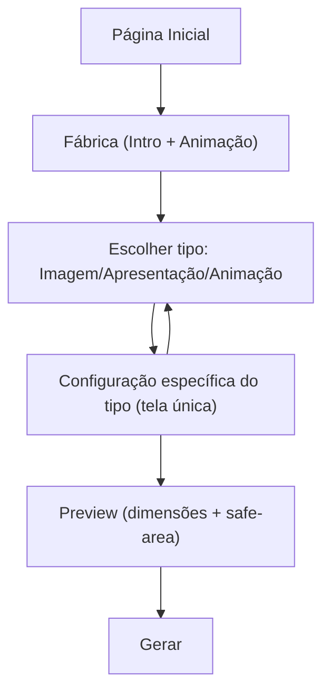

## 1. Product Overview
A **Fábrica** é o fluxo central para criar conteúdo a partir de configurações claras e visuais.
Você vê uma **animação inicial**, escolhe **Imagem / Apresentação / Animação** e configura tudo em uma única tela por tipo (sem wizard procedural).

## 2. Core Features

### 2.2 Feature Module
Os requisitos consistem das seguintes páginas principais:
1. **Página Inicial**: acesso direto para a Fábrica.
2. **Fábrica**: animação inicial + escolha do tipo (Imagem/Apresentação/Animação) e, em seguida, tela de configuração específica por tipo com preview e ação de gerar.

### 2.3 Page Details
| Page Name | Module Name | Feature description |
|-----------|-------------|---------------------|
| Página Inicial | Acesso à Fábrica | Direcionar para a página Fábrica. |
| Fábrica | Animação inicial | Exibir animação/intro curta ao entrar e apresentar o objetivo da Fábrica com CTA para começar. |
| Fábrica | Escolha do tipo | Selecionar **Imagem / Apresentação / Animação** e entrar diretamente na tela de configuração do tipo escolhido. |
| Fábrica | Trocar tipo | Permitir voltar para a escolha de tipo sem perder o contexto quando aplicável (ex.: confirmação). |
| Fábrica | Configuração por tipo (sem wizard) | Exibir, em **uma única tela**, apenas os controles relevantes do tipo selecionado (sem etapas procedurais). |
| Fábrica | Presets de formato (por tipo; sem números livres) | Selecionar formato via presets suportados pelo tipo e refletir dimensões no preview; impedir entrada manual fora dos presets. |
| Fábrica | Biblioteca de layouts com ícones (quando aplicável) | Escolher um layout estrutural via biblioteca visual com ícones e aplicar ao conteúdo do tipo selecionado. |
| Fábrica | Templates de Apresentação (quando tipo=Apresentação) | Escolher um template inicial para guiar estrutura e manter consistência visual. |
| Fábrica | Estrutura da apresentação (quando tipo=Apresentação) | Definir estrutura mínima (lista de slides/cards) e reordenar itens quando aplicável. |
| Fábrica | Brief/Prompt + opções realistas | Editar brief/prompt e opções em um único bloco; usar dropdowns/toggles/presets e evitar controles numéricos irreais. |
| Fábrica | Fontes (upload/seleção) | Enviar fontes para o Brand Kit do projeto e selecionar fonte primária e de títulos para uso nas gerações. |
| Fábrica | Preview pré-geração (dimensões + safe-area) | Exibir dimensões e overlay de safe-area antes de gerar, atualizado pelo tipo/preset/template. |
| Fábrica | Geração | Acionar a geração usando tipo + preset + configurações atuais. |

## 3. Core Process
Fluxo principal:
1. Você entra na **Página Inicial** e acessa a **Fábrica**.
2. Ao abrir a Fábrica, você vê a **animação inicial** e escolhe **Imagem / Apresentação / Animação**.
3. Você cai direto na **tela de configuração do tipo escolhido** (sem wizard entre etapas) e ajusta presets/brief/opções/fonte quando aplicável.
4. Você valida **dimensões + safe-area** no preview.
5. Você clica em **Gerar**.

