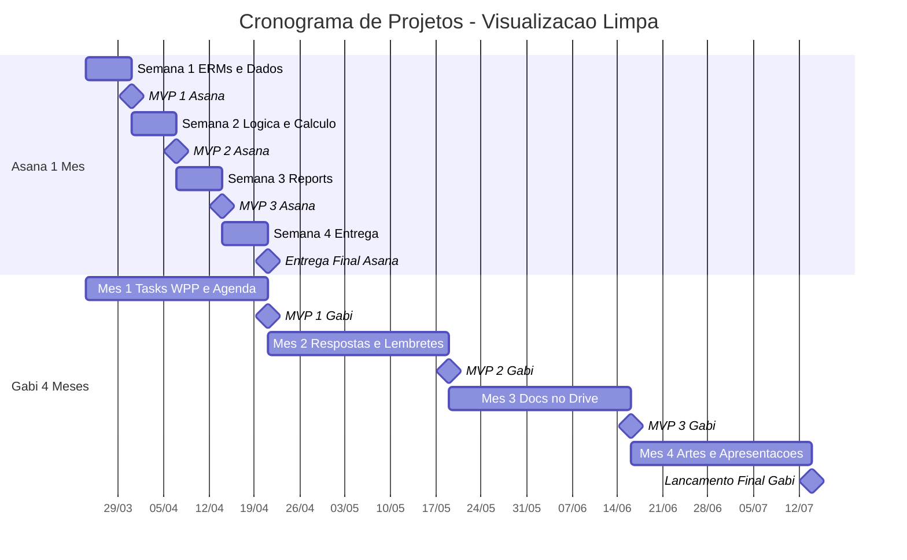

### 1. Automação de Notificação (Asana)

**Prazo Total:** 1 Mês (4 Semanas) | **Frequência de Testes:** 1 MVP por semana

Como o prazo é de um mês e exige validações semanais, o ideal é dividir as features (funcionalidades) em ciclos curtos de entrega para garantir que cada teste tenha um foco específico.

- **Semana 1: Infraestrutura e Dados**
    - **Desenvolvimento:** Estruturação do ERMs interno.
    - **Entrega:** MVP 1 (Teste da base de dados e integração inicial).
- **Semana 2: Lógica de Negócio**
    - **Desenvolvimento:** Implementação do cálculo e estimativa de tempo operacional.
    - **Entrega:** MVP 2 (Teste das regras de cálculo e precisão do tempo).
- **Semana 3: Visualização**
    - **Desenvolvimento:** Criação dos Reports internos.
    - **Entrega:** MVP 3 (Teste da geração de relatórios com dados reais).
- **Semana 4: Polimento e Lançamento**
    - **Desenvolvimento:** Correção de bugs, refinamento do sistema e validação final de todas as features conectadas.
    - **Entrega:** MVP 4 / Lançamento (Teste final do fluxo completo) e entrega oficial do projeto.

---

### 2. Secretaria A.i (Gabi)

**Prazo Total:** 4 Meses (Aprox. 16 Semanas) | **Frequência de Testes:** 1 MVP por mês

Este é um projeto mais longo e robusto. A divisão foi feita agrupando as features por similaridade técnica, garantindo um MVP funcional ao final de cada mês (a cada 4 semanas).

- **Mês 1 (Semanas 1 a 4): Comunicação e Agendamento**
    - **Desenvolvimento:** Integração de Tasks via WhatsApp (WPP) e Automatização da agenda Google.
    - **Entrega:** MVP 1 (Teste do fluxo de receber tarefas pelo WhatsApp e refleti-las na agenda).
- **Mês 2 (Semanas 5 a 8): Automação de Respostas e Follow-up**
    - **Desenvolvimento:** Configuração de Respostas Automáticas e sistema de Lembretes de tarefas.
    - **Entrega:** MVP 2 (Teste da Gabi interagindo automaticamente e enviando alertas de prazos).
- **Mês 3 (Semanas 9 a 12): Gestão de Documentos**
    - **Desenvolvimento:** Automação de envio de documentos para o Google Drive.
    - **Entrega:** MVP 3 (Teste do recebimento de arquivos e organização automática nas pastas corretas).
- **Mês 4 (Semanas 13 a 16): Geração de Ativos e Entrega Final**
    - **Desenvolvimento:** Automação com gerador de Apresentações e Artes. Revisão de todos os módulos.
    - **Entrega:** MVP 4 (Teste da geração de materiais visuais) e Lançamento oficial da versão completa.

---

### Lembrete de Gestão

- **Ação Pendente:** Confirmar com o gerente do Mercado Pago os juros e o número exato de parcelas para os valores em Gateway (1.000/mo x10 para o Asana e 1.200/mo x10 para a Gabi).

---

